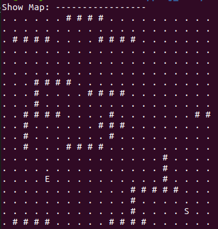
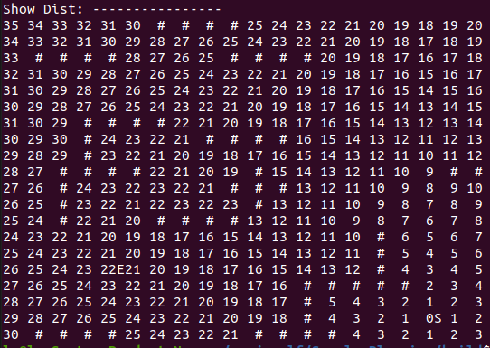
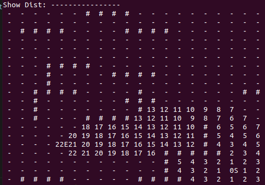

# Sample-Planning
A sample path planning such as Dijkstra, A*


## Files

```
project/
│
├── src/
│   ├── Map.cpp
│   ├── Dijkstra.cpp
│   ├── AStar.cpp
│   └── Utility.cpp
│
├── include/
│   ├── Map.h
│   ├── Point.h
│   ├── Dijkstra.h
│   ├── AStar.h
│   └── Utility.h
│
├── others/
│   └── image...
│
├── main.cpp
├── CMakeLists.txt
└── README.md
```
- Point存储坐标点
- Map文件生成地图，随机生成障碍物和起始点、结束点
- Dijkstra文件为Dijkstra算法
- AStar文件为A*算法

## Results

- 地图：起点'S'，终点'E'，障碍物'#'  


- Dijkstra  


- A*  

